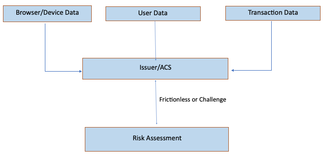
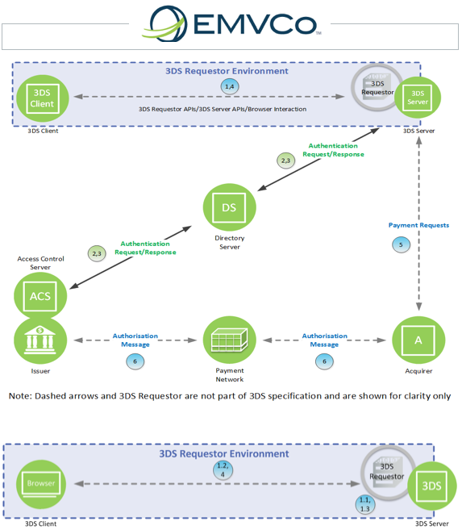

# EMV® 3-D Secure Requirements for Risk Assessment

The EMV® 3-D Secure Protocol (hereafter, "3DS") describes a
"frictionless flow." The “frictionless” flow involves risk assessment
by the issuing bank (or its Access Control Server partner) without
requiring a user gesture. On the Web, this is generally accomplished
by collecting device information (via JavaScript) during checkout and
looking for stability in the device information across transactions.

As changing browser behaviors alter the device information landscape,
the [Web Payment Security Interest
Group](https://www.w3.org/securepay/) is holding discussions about
what emerging browser capabilities could help fulfill risk assessment
requirements and privacy requirements.

This document is a requirements document to support those discussions.

Editors:

* [Ian Jacobs](mailto:ij@w3.org)
* Richard Ledain
* Sameer Tare

Status: This is a draft and represents no consensus.

## Background

EMV&reg; 3-D Secure (EMV 3DS below) helps prevent the unauthorized use of a card online and provides consumers and merchants with the confidence that they are protected from fraud, while also supporting an easy and convenient purchasing experience that reduces the number of declined transactions.

EMV 3DS is a fraud-prevention technology that enables consumers to authenticate themselves with their card issuer. EMV 3DS supports intelligent, data-driven and risk-based decisioning that encourages frictionless authentication. This means that for most transactions, the consumer clicks or taps online and the payment is approved.

For transactions that are higher risk, EMV 3DS provides an additional layer of security to validate that the individual making the purchase is the legitimate cardholder.

Examples of high risk transactions include

* Transactions made from a new device 
* Transactions made for an unusually large amount 
* Unexpected transaction types

## How does authentication work with EMV 3DS?

* **Consumer**. Consumer uses a payment card to make an online purchase on a mobile phone, tablet, laptop or other device.
* **Merchant**. To confirm that the consumer making the purchase is the actual cardholder, the merchant uses EMV 3DS for authentication. This involves sending data about the transaction, payment method and device information to the issuer.
* **Issuer**. Issuer reviews the data and performs a Risk Assessment. For transactions considered low risk, the Issuer may decide to complete the transaction as frictionless which essentially means that the data collected for this transaction was sufficient to let the transaction proceed without any explicit user credential verification. For transactions that are higher risk, EMV 3DS provides an additional layer of security by validating that the individual making the purchase is the legitimate cardholder. In these cases, the issuer can choose to prompt the consumer to authenticate themselves using a one-time-passcode, knowledge-based questions, biometrics or other method. It’s important to note that Issuers in most cases already receive this data and are bound by the local regulations on how to process this data.

### EMV 3DS Risk Assessment

### 3DS flows

* Start: Cardholder—The Cardholder initiates the transaction using a browser on a Consumer Device using a website operated by the 3DS Requestor.
* 1.1 3DS Requestor and 3DS Server—The 3DS Requestor communicates with the 3DS Server. The 3DS Server determines the ACS and DS Protocol Version(s) and, if present obtains the 3DS Method URL for the requested card range and returns the information to the 3DS Requestor. The ACS and DS Protocol Version(s) and 3DS Method URL data were previously received by the 3DS Server via a PRes message.
* 1.2 3DS Method on the 3DS Requestor checkout page—The 3DS Requestor checkout page loads the 3DS Method URL, if present, which allows the ACS to obtain additional browser information for risk-based decisioning.
* 1.3 3DS Requestor and 3DS Server—The 3DS Requestor provides the necessary 3-D Secure information for the transaction to the 3DS Server.
* 4. 3DS Server and 3DS Requestor—The 3DS Server communicates the result of the ARes message to the 3DS Requestor and completes the transaction. The 3DS Integrator determines how the interaction between these components is implemented.

## The Question

Is this the same device, the user has been associated with?

### The Answer (Devices supporting SDKs)

For transactions taking place on devices/platforms that support SDKs, the device identification is fairly structured and enables the issuer/ACS to leverage multiple identifiers to associate a device with the user. The device info parameters have been defined for following operating systems/platforms

* Android
* iOS
* Windows 10
* Platform Device Data

### The Answer (Browser)

Data related to the browser being used to perform EMV 3DS transactions is collected via 2 channels

* 3DSMethod – This is a mechanism for the issuer/ACS to obtain additional browser data prior to authentication request flow. This browser data in addition to the other information available to the ACS/Issuer through authentication flow aids in the transaction risk assessment and associated decision on completing the transaction as frictionless or asking for additional user credentials through a step-up/challenge. 3DSMethod is a javascript executed on the browser and is owned and maintained by the Issuer/ACS and it is made available to the browser through a trusted party in the EMV 3DS Flow called as 3DS Server. The data collected by this method is proprietary to each issuer/ACS as determined by their risk engines.
* Browser Data in Authentication Request (AReq). This is the mechanism by which a list of browser data is carried through the EMV 3DS AReq data elements. This information in addition to the data issuer/ACS might have collected as part of 3DSMethod execution allows for intelligent risk-based decisions along with the optimization of the user experience. The data collected as part of this method is defined by the EMV 3DS Specification and is as follows: Accept Headers, IP Address, Java Enable, JavaScript Enabled, Language, Screen Color Depth, Screen Height and Width, Time Zone, and User-Agent string.

## Problem Statement

* Issuers rely on a combination of existing identifiers to identify the device
* These identifiers could be originally intended to be used for other purposes and are likely to change in future
* Privacy controls on the browser data inadvertently impact browser data for risk assessment which can result in more challenges for users during transactions
* There are no unique identifiers defined for Transaction Risk Assessment
* As the issuers interact with cardholder through iframe in merchant webpage, using cookies is not a viable approach
* There is lack of hardware based, immutable identifiers that could be derived from browsers for use in Risk Assessment

## Finding a Solution

Device recognition is and will remain a critical need for Transaction Risk Assessments in all Card Not Present (CNP) Transactions. The following statement describes the ideal solution at a high level that is desired to be achieved as a result of this collaboration: Find a way to identify a browser in a unique, privacy aligned manner to be used exclusively for Transaction Risk Assessment in a payment context.

### Goals 

* Enable new identifiers/identification mechanism are generated and protected by browser core libraries
* Enable the new identifiers/identification mechanism to be accessed/used only in payment context 
* Ensure the new identifiers/identification mechanism are in alignment with W3C/PING road-map
* Ensure any required user actions do not interrupt the user experience during payments flow

Furthermore, the ideal solution will not:

* Enable tracking of users outside of a payment context
* Enable creation of a super-cookie used for all sorts of device recognition
* Result in more friction through user gestures/interactions than present today

### Requirements

* These identifiers will be unique for each browser instance
* These identifiers will be generated and protected by browser core libraries and will be generated through native API calls
* User will have option to reset the identifier, upon resetting the user may see more friction (challenge in 3DS context) until the new identifiers are part of issuer/ACS risk models
* User enrollment/consent takes place outside of the payments context and does not interrupt the payment flow

## Acknowledgments

EMV® is a registered trademark in the U.S. and other countries and an unregistered trademark elsewhere. The EMV trademark is owned by EMVCo, LLC.
