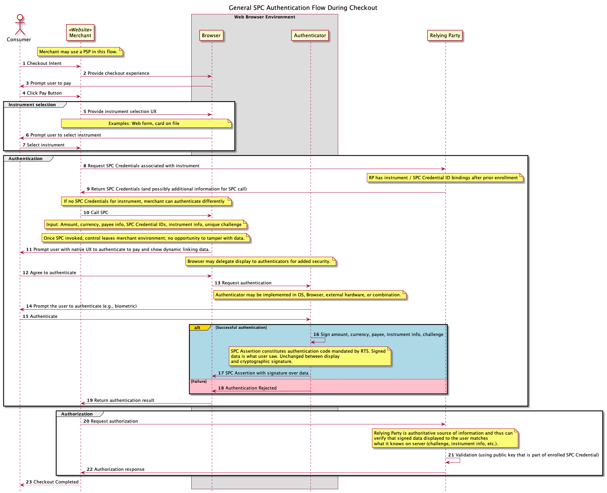

# Using SPC to fulfill PSD2 Requirements for SCA and Dynamic Linking

Status: This is a draft document without consensus. Questions? Ian Jacobs &lt;ij@w3.org>.

[Secure Payment Confirmation
(SPC)](https://github.com/w3c/secure-payment-confirmation) is a new
Web API to support streamlined authentication during a payment
transaction. In this document we explain how SPC can be used to
fulfill the Strong Customer Authentication (SCA) and Dynamic Linking
requirements of Payment Services Directrive (PSD2).

Note: In this document we assume that SPC leverages FIDO Authentication.  We therefore recommend familiarity with <a href="https://fidoalliance.org/">FIDO Authentication</a> and specifically the <a href="https://www.w3.org/Webauthn/">Web Authentication specification</a>.

## Background

SPC is being designed for use within a wide range of payment methods
(cards, open banking, proprietary payment methods, etc.) and within a
variety of authentication protocols (including, but not limited to,
EMV® 3-D Secure). W3C is working closely with the FIDO Alliance,
EMVCo, and other partners to achieve a number of benefits through SPC:

* **Authentication Streamlined for Payment**. We expect SPC to build on the FIDO authentication experience in several ways, by further accelerating authentication (compared to one-time passcodes), requiring fewer user gestures, offering a predictable user experience across sites, and avoiding redirects.
* **Scalable and Ubiquitous**. SPC supports streamlined authentication across multiple merchant sites following a single enrollment.
* **Simpler and more Secure Front-end Deployment**. The browser (or secure hardware) manages the display of the payment confirmation experience, removing the need for other parties (e.g., issuing banks or payment apps) to do so. In addition, enabling payment service providers or others to authenticate the user can reduce the need to embed code provided by a Relying Party in a Web page, reducing security risks. Reducing the need for redirects should also simplify solutions.
* **Designed to Meet Regulatory Requirements**. The standardized payment confirmation user experience is designed to help entities fulfill regulatory requirements (e.g., strong customer authentication and dynamic linking under PSD2) and other customer authentication use cases.

In this document we focus on the last point: how to use SPC to full
PDS2 requirements.

## Unique SPC Features

The above benefits are grounded in a small number of unique features that distinguish SPC from FIDO authentication "out of the box":

* **Browser-native UX for payment confirmation**. The browser (or secure hardware) provides a consistent and efficient authentication UX across merchant sites and relying parties.
* **Cryptographic evidence**. Payment confirmation generates cryptographic evidence of the user's confirmation of payment details.
* **Cross-origin authentication**. With FIDO, the Relying Party that creates FIDO credentials is the only origin that can generate an assertion with those credentials to authenticate the user. With SPC, any origin can generate an assertion during a transaction even by leveraging another Relying Party's credentials.

These features are used to satisfied two key PSD2 requirements:

* **Strong Customer Authentication (SCA)**:FIDO Authentication is used to fulfill the SCA requirement. SPC's cross-origin authentication reduces user experience friction by requiring fewer enrollments.
* **Dynamic linking**: SPC adds to browsers built-in support for the display of dynamic linking data and cryptographic proof (via FIDO) of what data was displayed.

## General SPC Flow

SPC consists of two phases: enrollment and authentication. The
following flow diagram provides a general view of the parties involved
in SPC Authentication. 

The flow diagram describes general roles. Each specific payment
ecosystem or authentication protocol will determine which parties play
which roles. For example, when SPC is used with EMV® 3-D Secure, the
Access Control Server (ACS) or issuing bank or card network might be
the Relying Party. Or, within EMV® Secure Remote Commerce, the SRC
System might be the Relying Party.

### SPC and Delegated Authentication

As mentioned earlier, one design goal of SPC is to scale across
merchants. The general SPC flow emphasizes this point: the user
enrolls for SPC authentication once (e.g., with the issuing bank) and
can then authenticate on any merchant site without re-enrolling.

SPC can also be used in "delegated authentication" use cases, where
the merchant (or their payment service provider) is the Relying
Party. When the merchant or payment service provider, is the Relying
Party:

* The "native browser UX" and "cryptographic evidence" benefits of SPC
  remain relevant, but there is likely to be less "scalability across
  merchants."

* Other parties in the payment ecosystem (e.g., the ACS in EMV® 3-D
  Secure) may not be in a position to directly validate the
  authentication results, but the authentication may still be useful
  as part of a risk assessment strategy. As an example of such a
  strategy, see [Technical Note: FIDO Authentication and EMV 3-D
  Secure – Using FIDO for Payment
  Authentication](https://fidoalliance.org/technical-note-fido-authentication-and-emv-3-d-secure-using-fido-for-payment-authentication/)
  by the FIDO Alliance.

## SPC Used in Various Authentication Protocols

### EMV 3-D Secure

### EMV Secure Remote Commerce

### Open Banking

## Detailed Evaluation of PSD2 Requirements and SPC

The PSD2 requirements below are drawn from [Regulatory Technical Standards on strong customer authentication and secure communication under PSD2 ](https://www.eba.europa.eu/sites/default/documents/files/documents/10180/1761863/314bd4d5-ccad-47f8-bb11-84933e863944/Final%20draft%20RTS%20on%20SCA%20and%20CSC%20under%20PSD2%20%28EBA-RTS-2017-02%29.pdf) (23 February 2017 edition).

Note: This evaluation approach is based on [How FIDO Standards Meet PSD2’s Regulatory Technical Standards Requirements On Strong Customer Authentication](https://fidoalliance.org/how_fido_meets_the_rts_requirements/) from the FIDO Alliance. Below, this document is identified as "FIDO-PSD2".

### [RTS Chapter 1] General provisions

#### [RTS Article 3] – Review of the Security Requirements

| Article     | Requirement | How SPC Meets It |
| ----------- | ----------- | ----------- |
| Article 3.1 | The implementation of the security measures referred to in Article 1 shall be documented, periodically tested, evaluated and audited in accordance with the applicable legal framework of the payment service provider by auditors with expertise in IT security and payments and operationally independent within or from the payment service provider | See FIDO-PSD2 for information about FIDO security certification. In addition, W3C provides publicly available tests for Web APIs to improve cross-browser interoperability. |

### [RTS Chapter II] Security measures for the application of Strong Customer
Authentication

### [RTS Chapter IV] Confidentiality and integrity of the Payment Service User’s
security credentials